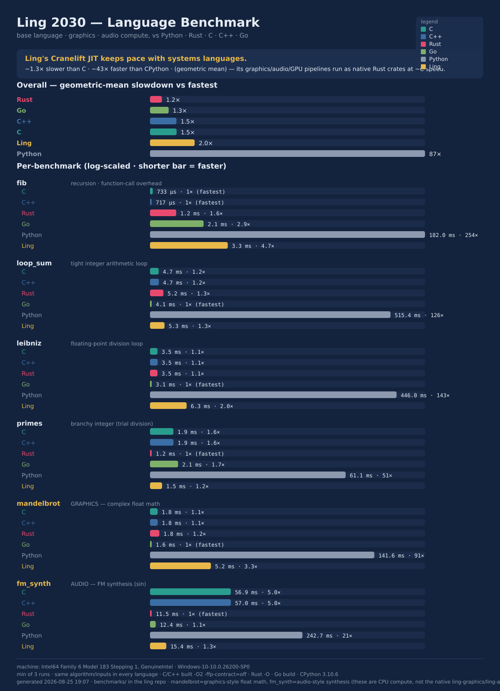
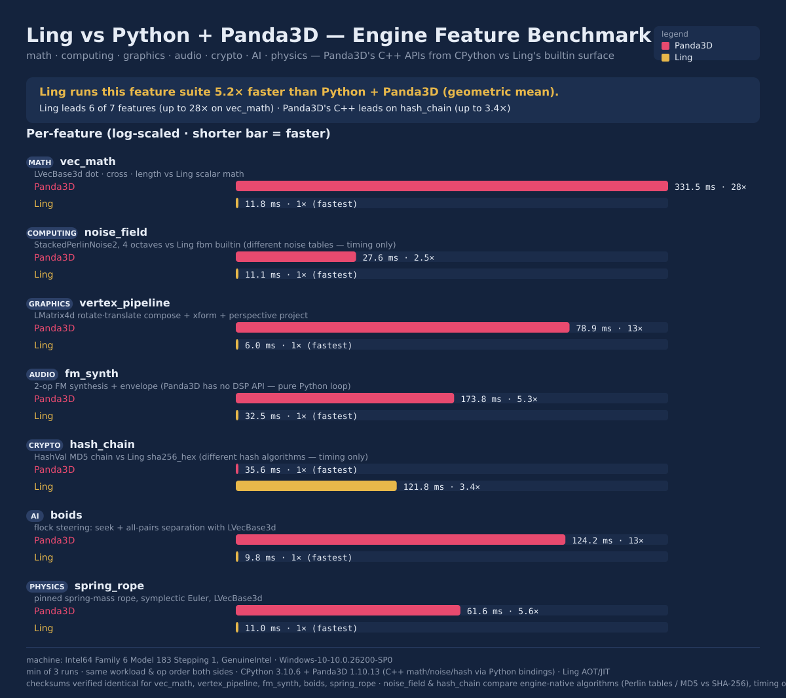

# Ling Benchmark Suite

A cross-language benchmark comparing **Ling** against **Python, Rust, C, C++,
and Go** on the same workloads, plus a generated infographic.



## What it measures

Six CPU workloads, written *identically* in every language (same algorithm,
same inputs, same checksum) so the only variable is the language/runtime:

| Bench | Tests | Notes |
|-------|-------|-------|
| `fib` | recursion, function-call overhead | `fib(30)` |
| `loop_sum` | tight integer arithmetic loop | 10M iterations |
| `leibniz` | floating-point division | 5M terms (π) |
| `primes` | branchy integer code | count primes < 50,000 (trial division) |
| `mandelbrot` | **graphics-style** complex float math | 200×200, 100 iters |
| `fm_synth` | **audio-style** synthesis | 1M FM/`sin` samples |

> The graphics/audio rows are *CPU-compute microbenchmarks* in the base
> language — a fair cross-language signal for "how fast is the language at
> graphics/audio math." Ling's **real** graphics/audio/GPU pipelines
> (`ling-graphics`, `ling-audio`, `ling-gpu`) are native Rust crates and run at
> ~C speed regardless of the interpreter; they are not what these rows measure.

## Run it

```sh
# from this directory (needs: ling built, python, rustc, gcc, g++, go)
python run_benchmarks.py            # 3 runs each (best wins)
python run_benchmarks.py 5          # more runs = less noise
```

It auto-discovers toolchains (Ling is taken from `../target/release/ling`),
compiles the native programs into `bin/`, runs each program N times keeping the
**minimum** time per benchmark, **verifies all languages agree on the checksum**,
writes `results.json`, and renders `ling_benchmark.svg`.

Regenerate just the infographic from existing results:

```sh
python make_infographic.py results.json ling_benchmark.svg
```

## Panda3D feature suite

A second suite compares **Ling's builtin surface** against **Python + Panda3D**
(the C++ game engine via its Python bindings) across engine-feature categories:



| Bench | Category | Panda3D feature | Ling equivalent |
|-------|----------|-----------------|-----------------|
| `vec_math` | MATH | `LVecBase3d` dot/cross/length | scalar math |
| `noise_field` | COMPUTING | `StackedPerlinNoise2` (4 octaves) | `fbm` builtin |
| `vertex_pipeline` | GRAPHICS | `LMatrix4d` compose + xform + project | scalar transform |
| `fm_synth` | AUDIO | *(no DSP API — pure Python)* | `sin`/`exp` |
| `hash_chain` | CRYPTO | `HashVal` (MD5, C++) | `sha256_hex` |
| `boids` | AI | steering with `LVecBase3d` | lists + scalar math |
| `spring_rope` | PHYSICS | spring rope with `LVecBase3d` | lists + scalar math |

```sh
python run_panda_benchmarks.py       # needs: pip install panda3d
```

Writes `panda_results.json` + `panda_benchmark.svg`. Checksums are verified
identical for `vec_math`, `vertex_pipeline`, `fm_synth`, `boids`, and
`spring_rope`; `noise_field`/`hash_chain` intentionally compare each engine's
*native* algorithm (different Perlin tables; MD5 vs SHA-256), so only timing is
compared. Two fairness details worth knowing: Panda3D's MSVC build fuses
multiply-adds (FMA) inside `dot`/`length_squared`, so the boids flock uses a
smooth separation falloff (no distance cutoff) to keep 1-ulp differences from
flipping branches; and both sides multiply by an explicit reciprocal instead of
using Panda3D's `/=`, which C++ implements as reciprocal-multiply.

## Methodology / fairness notes

- **Internal timing.** Each program times only the compute region with a
  monotonic clock (Ling uses `time_now()`), so process startup, parsing, and
  compilation are excluded.
- **Native build flags.** C/C++ `-O2 -ffp-contract=off` (the `off` keeps FMA
  from changing float results so checksums match), Rust `-O`, Go `go build`,
  CPython stock.
- **Same arithmetic everywhere.** Ling numbers are `f64`; the other languages
  use `i64` for integer benches and `f64` for float benches, with sizes chosen
  so integer results stay exact (< 2⁵³).
- **Best of N.** Reduces scheduler noise; report is reproducible within ~10%.

## Honest takeaways

- These numbers are for `ling run --jit` (the default backend, Cranelift —
  see `crates/ling-codegen/`), not the tree-walking interpreter (`ling run
  --interp`, kept as the semantic reference/fallback in `src/runtime/`), which
  is far slower and not what this suite measures.
- On the JIT, Ling is ~1.7× slower than C and ~34× faster than CPython
  (geometric mean) — competitive with Go and within reach of Rust/C++ on most
  workloads.
- The gap to C/Rust is **smallest** on heavy-`sin` work (`fm_synth`), where
  everyone is bottlenecked on `libm` — and even shows mingw's `sin()` making
  C/C++ slower than Rust/Go here. The gap is **largest** on `fib`, where
  function-call overhead dominates and native inlining wins.
