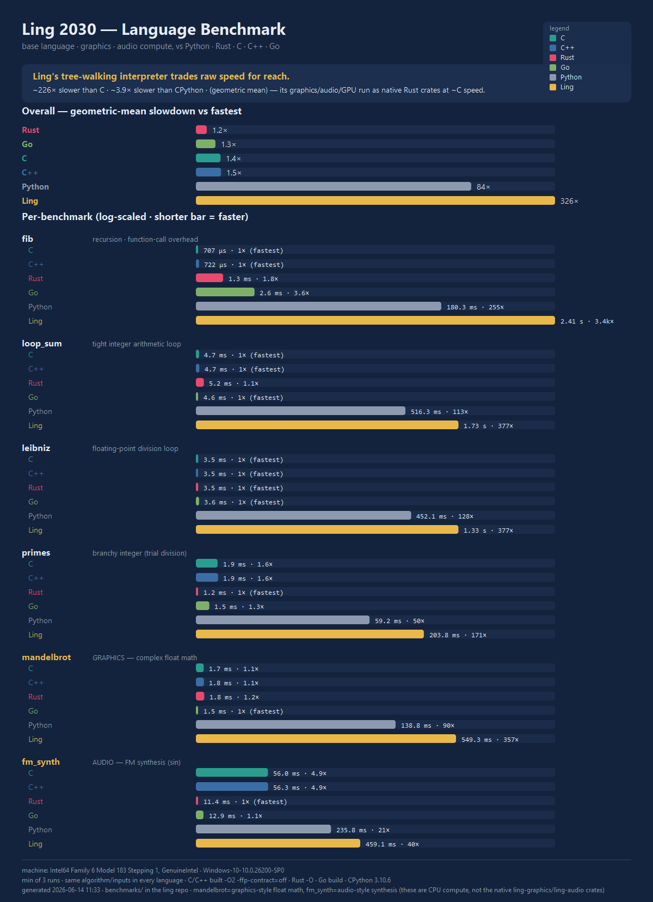

# Ling Benchmark Suite

A cross-language benchmark comparing **Ling** against **Python, Rust, C, C++,
and Go** on the same workloads, plus a generated infographic.



## What it measures

Six CPU workloads, written *identically* in every language (same algorithm,
same inputs, same checksum) so the only variable is the language/runtime:

| Bench | Tests | Notes |
|-------|-------|-------|
| `fib` | recursion, function-call overhead | `fib(30)` |
| `loop_sum` | tight integer arithmetic loop | 10M iterations |
| `leibniz` | floating-point division | 5M terms (π) |
| `primes` | branchy integer code | count primes < 50,000 (trial division) |
| `mandelbrot` | **graphics-style** complex float math | 200×200, 100 iters |
| `fm_synth` | **audio-style** synthesis | 1M FM/`sin` samples |

> The graphics/audio rows are *CPU-compute microbenchmarks* in the base
> language — a fair cross-language signal for "how fast is the language at
> graphics/audio math." Ling's **real** graphics/audio/GPU pipelines
> (`ling-graphics`, `ling-audio`, `ling-gpu`) are native Rust crates and run at
> ~C speed regardless of the interpreter; they are not what these rows measure.

## Run it

```sh
# from this directory (needs: ling built, python, rustc, gcc, g++, go)
python run_benchmarks.py            # 3 runs each (best wins)
python run_benchmarks.py 5          # more runs = less noise
```

It auto-discovers toolchains (Ling is taken from `../target/release/ling`),
compiles the native programs into `bin/`, runs each program N times keeping the
**minimum** time per benchmark, **verifies all languages agree on the checksum**,
writes `results.json`, and renders `ling_benchmark.svg`.

Regenerate just the infographic from existing results:

```sh
python make_infographic.py results.json ling_benchmark.svg
```

## Methodology / fairness notes

- **Internal timing.** Each program times only the compute region with a
  monotonic clock (Ling uses `time_now()`), so process startup, parsing, and
  compilation are excluded.
- **Native build flags.** C/C++ `-O2 -ffp-contract=off` (the `off` keeps FMA
  from changing float results so checksums match), Rust `-O`, Go `go build`,
  CPython stock.
- **Same arithmetic everywhere.** Ling numbers are `f64`; the other languages
  use `i64` for integer benches and `f64` for float benches, with sizes chosen
  so integer results stay exact (< 2⁵³).
- **Best of N.** Reduces scheduler noise; report is reproducible within ~10%.

## Honest takeaways

- Ling's **tree-walking interpreter** is currently ~hundreds× slower than C and
  a few× slower than CPython — expected for an AST interpreter with no bytecode
  VM or JIT (see `src/runtime/`).
- The gap is **smallest** on heavy-`sin` work (`fm_synth`), where everyone is
  bottlenecked on `libm` — and even shows mingw's `sin()` making C/C++ slower
  than Rust/Go here.
- The path to closing the gap is a **bytecode VM** or the existing
  MIR→codegen/LLVM backend; the interpreter is the speed ceiling today.
