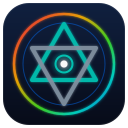

# ling-ui

Ling UI framework — retained-mode widgets and flex layout

Part of the [Ling](https://ling-lang.org) programming language ecosystem. See the [main repository](https://github.com/taellinglin/ling) for docs, examples, and the full workspace.
